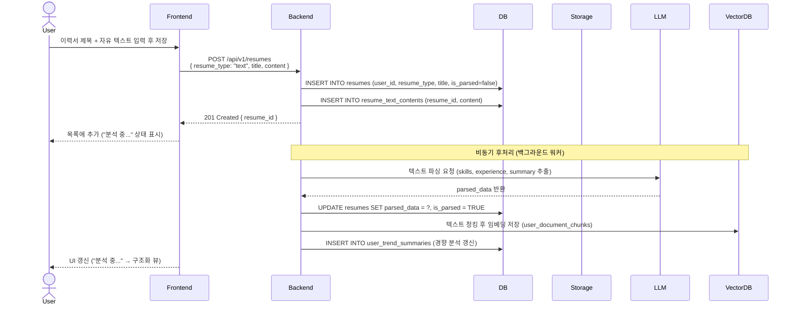
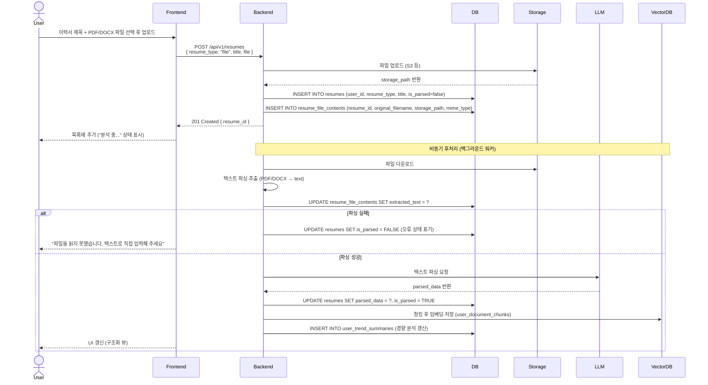

# SD-DOC-001 이력서 등록

> 대응 UC: [UC-DOC-001](../use-cases/UC-DOC-001-이력서_등록_및_관리.md)

---

## 자유 텍스트 입력

---

## 파일 업로드

---

## 비고

- 이력서는 필수 사항. 등록 없이는 면접 시작 불가능
- `is_parsed = false` 동안 UI는 "분석 중..." 폴백 뷰 표시
- 여러 이력서 등록 가능. 각각 `is_active`로 활성화/비활성화 관리
