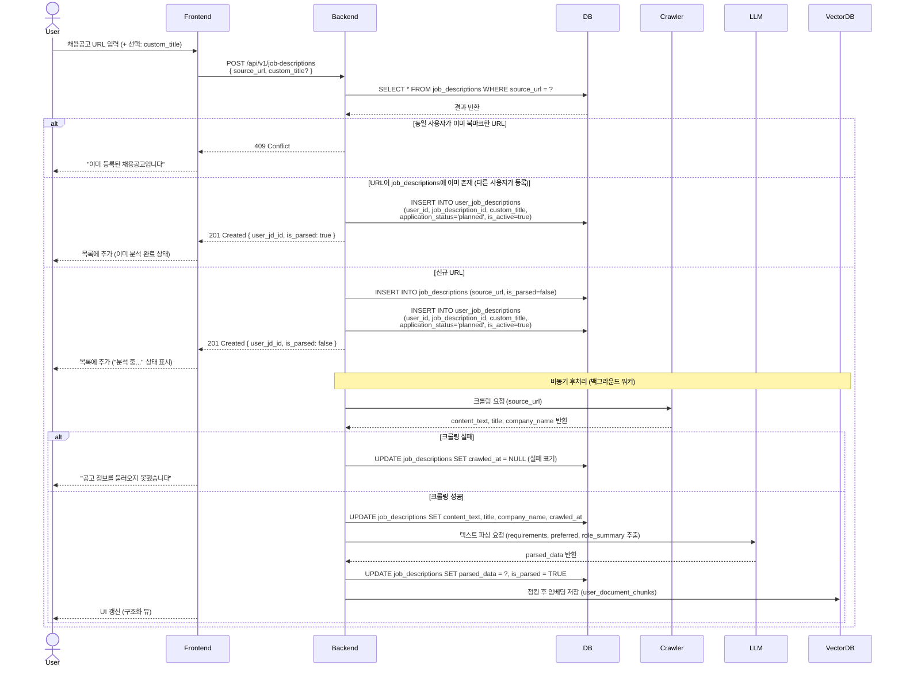

# SD-DOC-002 채용공고 등록

> 대응 UC: [UC-DOC-002](../use-cases/UC-DOC-002-채용공고_등록_및_관리.md)

---

---

## 비고

- `job_descriptions`는 URL 기준 공유 원문. 크롤링은 최초 1회만 수행
- `user_job_descriptions`는 사용자별 북마크 레이어. `is_active`로 면접 질문 생성 포함 여부 제어
- 삭제 시 `user_job_descriptions` 행만 제거. 공유 원문(`job_descriptions`)은 유지
