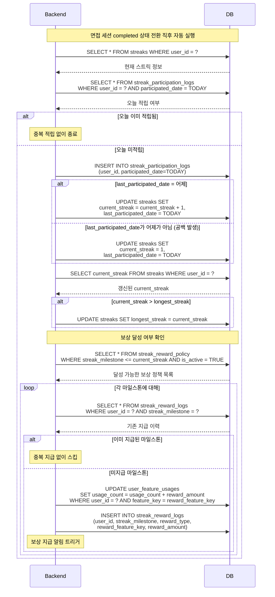

# SD-GMF-001 스트릭 적립 및 보상

> 대응 UC: [UC-GMF-001](../use-cases/UC-GMF-001-스트릭_적립.md), [UC-GMF-004](../use-cases/UC-GMF-004-스트릭_보상_수령.md)

---

---

## 비고

- 스트릭 적립은 `completed` 세션에서만 발생. `abandoned`는 적립 안 됨
- 하루 여러 번 면접 완료해도 `streak_participation_logs`의 UNIQUE 제약으로 1회만 기록
- 보상 정책은 `streak_reward_policy` 테이블에서 운영팀이 코드 배포 없이 관리
