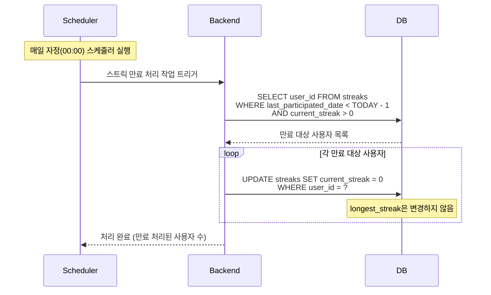

# SD-GMF-002 스트릭 만료 처리

> 대응 UC: [UC-GMF-003](../use-cases/UC-GMF-003-스트릭_만료_처리.md)

---

---

## 비고

- `longest_streak`은 초기화 대상이 아님. 역대 최장 기록은 영구 보존
- `last_participated_date`가 어제인 사용자는 만료 대상에서 제외 (오늘 면접 예정 가능)
- 만료 알림(푸시/이메일)은 선택적 구현 사항
