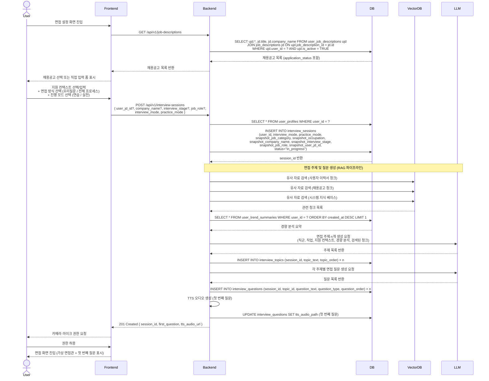

# SD-INT-001 면접 설정 및 시작

> 대응 UC: [UC-INT-001](../use-cases/UC-INT-001-면접_설정_및_시작.md)

---

---

## 비고

- 세션 시작 시점의 `job_category`, `occupation`, `company_name`, `interview_stage`, `job_role`, `user_jd_id`는 모두 `snapshot_*` 컬럼에 저장되어 이후 프로필·채용공고 변경과 무관하게 보존됨
- 채용공고 선택 시 `snapshot_user_jd_id`로 참조. 이후 해당 북마크가 삭제되어도 스냅샷은 유지됨 (`ON DELETE SET NULL`)
- 지원 컨텍스트 없이 시작 시 프로필 정보(직군, 직업)만으로 주제 생성
- 이후 흐름: [SD-INT-002-꼬리질문_방식_면접_진행.md](./SD-INT-002-꼬리질문_방식_면접_진행.md)
