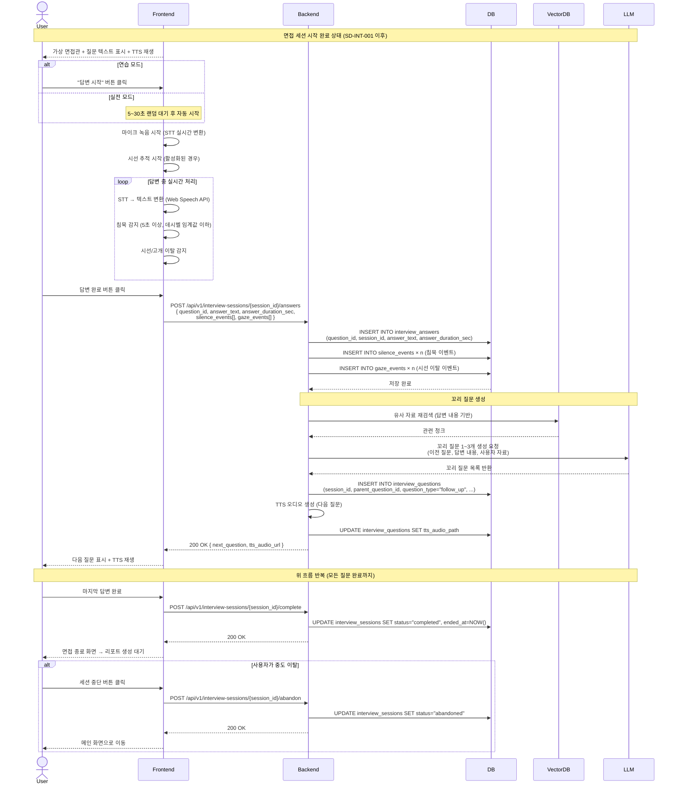

# SD-INT-002 꼬리질문 방식 면접 진행

> 대응 UC: [UC-INT-002](../use-cases/UC-INT-002-꼬리_질문_방식_면접_진행.md)

---

---

## 비고

- STT는 브라우저 Web Speech API 사용 (Chrome 기준)
- 침묵 감지·시선 추적은 프론트엔드에서 실시간 처리 후 답변 완료 시 일괄 전송
- 꼬리 질문은 최소 1개, 최대 3개
- 세션 완료 후 리포트 생성: [SD-INT-003-면접_리뷰_리포트.md](./SD-INT-003-면접_리뷰_리포트.md)
