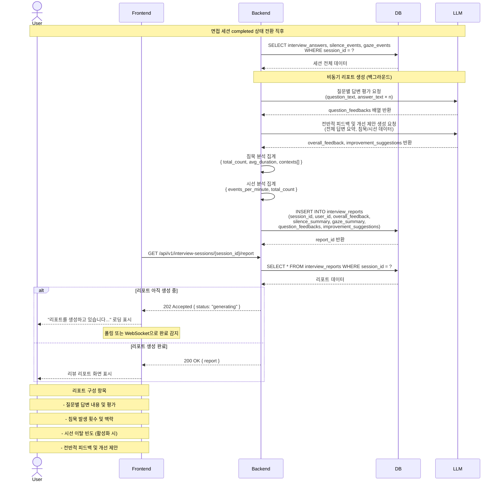

# SD-INT-003 면접 리뷰 리포트

> 대응 UC: [UC-INT-004](../use-cases/UC-INT-004-면접_리뷰_리포트_확인.md)

---

---

## 비고

- 리포트 생성은 비동기. 완료 전까지 로딩 상태 표시
- 이전 세션 리포트는 세션 목록에서 재조회 가능
- `interview_reports.is_pro_report`로 요금제별 상세 수준 구분
