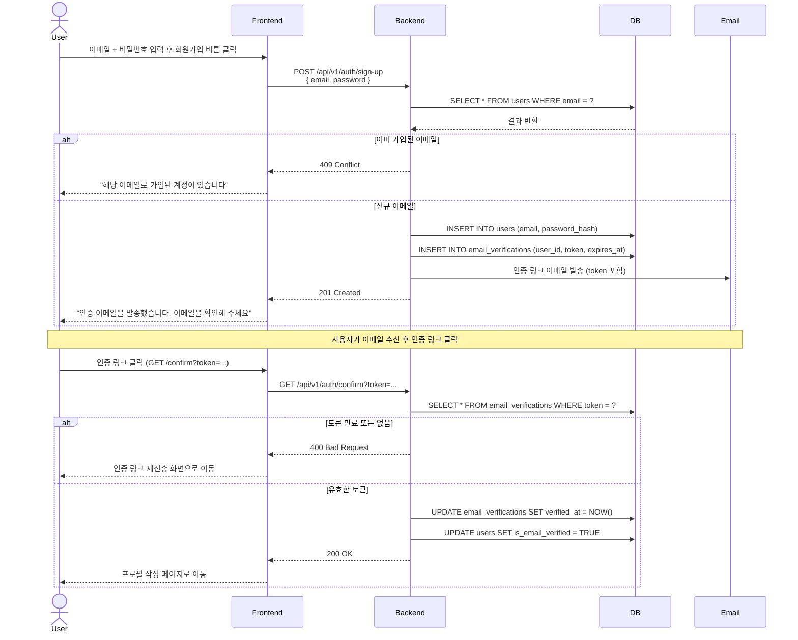

# SD-USR-001 회원가입

> 대응 UC: [UC-USR-001](../use-cases/UC-USR-001-회원_가입.md)

---

---

## 비고

- 인증 링크 만료 시 [SD-USR-002-로그인.md](./SD-USR-002-로그인.md) 이후 재전송 화면으로 유도
- 인증 완료 후 프로필 작성은 [SD-USR-003-프로필_최초_작성.md](./SD-USR-003-프로필_최초_작성.md) 참조
