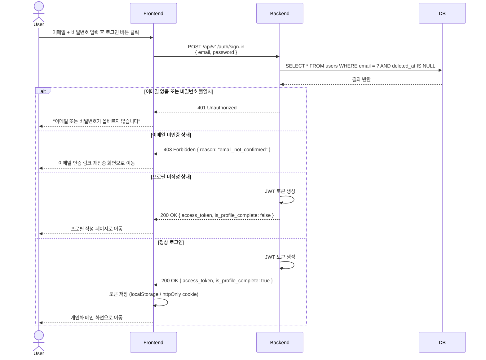

# SD-USR-002 로그인

> 대응 UC: [UC-USR-003](../use-cases/UC-USR-003-로그인.md)

---

---

## 비고

- JWT 기반 인증. 이후 모든 API 요청에 `Authorization: Bearer <token>` 헤더 포함
- `is_profile_complete = false`이면 프로필 작성 페이지로 강제 이동
