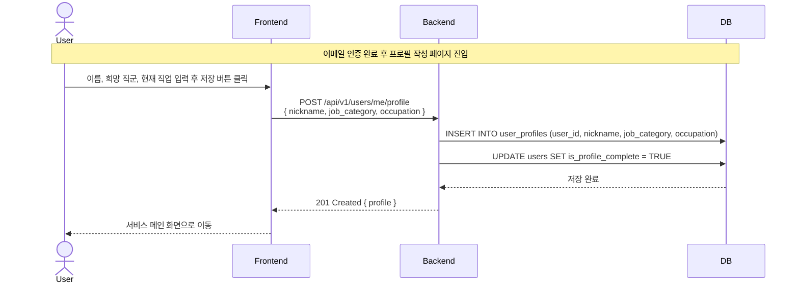

# SD-USR-003 프로필 최초 작성

> 대응 UC: [UC-USR-002](../use-cases/UC-USR-002-프로필_최초_작성.md)

---

---

## 비고

- 희망 직군(`job_category`)은 전체 사회 직군 목록에서 선택
- 프로필 정보는 이후 면접 질문 생성 시 동적으로 반영됨
- 수정은 [UC-USR-004](../use-cases/UC-USR-004-개인_정보_수정.md) 참조
