# 사이트맵 (Sitemap)

> 가상면접 웹 서비스의 전체 화면 구조 및 접근 권한

---

## 접근 권한 범례

| 기호 | 액터 |
|------|------|
| 🌐 | `Guest` — 비로그인 방문자 |
| 📧 | `UnconfirmedUser` — 이메일 미인증 |
| 🔰 | `OnboardingUser` — 프로필 미작성 |
| 👤 | `AuthenticatedUser` — 인증 사용자 (FreeUser + ProUser) |

---

## 다이어그램

```mermaid
flowchart TD

    %% ── 비로그인 ────────────────────────────────────
    subgraph PUBLIC["🌐 비로그인 (Guest)"]
        direction TB
        LANDING["/<br>소개 페이지"]
        SIGNIN["/sign-in<br>로그인"]
        SIGNUP["/sign-up<br>회원가입"]
        CONFIRM["/sign-up/confirm<br>이메일 인증 안내"]
        LANDING ~~~ SIGNIN ~~~ SIGNUP --> CONFIRM
    end

    %% ── 온보딩 ──────────────────────────────────────
    subgraph ONBOARDING["🔰 온보딩 (OnboardingUser)"]
        ONBOARD["/onboarding<br>프로필 최초 작성"]
    end

    %% ── 메인 ────────────────────────────────────────
    HOME["👤 /home<br>개인화 메인 화면"]

    %% ── 가상 면접 ───────────────────────────────────
    subgraph INTERVIEW["👤 가상 면접 (INT)"]
        direction TB
        INT_SETUP["/interview/setup<br>면접 설정"]
        INT_FU["/interview/:id<br>꼬리질문 방식"]
        INT_FP["/interview/:id<br>전체 프로세스 방식"]
        INT_REPORT["/interview/:id/report<br>리뷰 리포트"]
        INT_SETUP --> INT_FU
        INT_SETUP --> INT_FP
        INT_FU --> INT_REPORT
        INT_FP --> INT_REPORT
    end

    %% ── 이력서 ──────────────────────────────────────
    subgraph RESUME_GRP["👤 이력서 (DOC)"]
        direction TB
        RESUME["/resumes<br>목록"]
        RESUME_NEW["/resumes/new<br>등록"]
        RESUME_DETAIL["/resumes/:id<br>상세"]
        RESUME --> RESUME_NEW
        RESUME --> RESUME_DETAIL
    end

    %% ── 채용공고 ────────────────────────────────────
    subgraph JD_GRP["👤 채용공고 (DOC)"]
        direction TB
        JD["/job-descriptions<br>목록"]
        JD_NEW["/job-descriptions/new<br>등록"]
        JD_DETAIL["/job-descriptions/:id<br>상세"]
        JD --> JD_NEW
        JD --> JD_DETAIL
    end

    %% ── 지원 현황 ───────────────────────────────────
    subgraph APP_GRP["👤 지원 현황 (DOC)"]
        direction TB
        APP["/applications<br>목록"]
        APP_NEW["/applications/new<br>등록"]
        APP_DETAIL["/applications/:id<br>상세"]
        APP --> APP_NEW
        APP --> APP_DETAIL
    end

    %% ── 스트릭 ──────────────────────────────────────
    subgraph STREAK_GRP["👤 스트릭 (GMF)"]
        direction TB
        STREAK["/streak<br>현황"]
        STREAK_REWARD["/streak/rewards<br>보상 수령"]
        STREAK --> STREAK_REWARD
    end

    %% ── 요금제 ──────────────────────────────────────
    subgraph SUB_GRP["👤 요금제 (SUB)"]
        direction TB
        SUB["/subscription<br>조회·변경"]
        SUB_PRO["/subscription/upgrade<br>Pro 업그레이드"]
        SUB --> SUB_PRO
    end

    %% ── 계정 설정 ───────────────────────────────────
    subgraph SETTINGS_GRP["👤 계정 설정 (USR/PVC)"]
        direction TB
        SETTINGS_PROFILE["/settings/profile<br>프로필 수정"]
        SETTINGS_PASSWORD["/settings/password<br>비밀번호 변경"]
        SETTINGS_CONSENT["/settings/consent<br>동의 관리"]
        SETTINGS_PROFILE ~~~ SETTINGS_PASSWORD ~~~ SETTINGS_CONSENT
    end

    %% ── 전체 흐름: 세로 단일 체인 ──────────────────
    PUBLIC --> ONBOARDING
    CONFIRM -->|인증 완료| ONBOARD
    ONBOARD -->|프로필 완료| HOME
    HOME --> INTERVIEW
    INTERVIEW ~~~ RESUME_GRP
    RESUME_GRP ~~~ JD_GRP
    JD_GRP ~~~ APP_GRP
    APP_GRP ~~~ STREAK_GRP
    STREAK_GRP ~~~ SUB_GRP
    SUB_GRP ~~~ SETTINGS_GRP
    HOME -.-> RESUME_GRP
    HOME -.-> JD_GRP
    HOME -.-> APP_GRP
    HOME -.-> STREAK_GRP
    HOME -.-> SUB_GRP
    HOME -.-> SETTINGS_GRP

    %% ── 스타일 ──────────────────────────────────────
    classDef guest   fill:#f0f0f0,stroke:#999,color:#333
    classDef onboard fill:#d1ecf1,stroke:#17a2b8,color:#333
    classDef auth    fill:#d4edda,stroke:#28a745,color:#333
    classDef home    fill:#cfe2ff,stroke:#0d6efd,color:#333

    class LANDING,SIGNIN,SIGNUP,CONFIRM guest
    class ONBOARD onboard
    class HOME home
    class INT_SETUP,INT_FU,INT_FP,INT_REPORT auth
    class RESUME,RESUME_NEW,RESUME_DETAIL auth
    class JD,JD_NEW,JD_DETAIL auth
    class APP,APP_NEW,APP_DETAIL auth
    class STREAK,STREAK_REWARD,SUB,SUB_PRO auth
    class SETTINGS_PROFILE,SETTINGS_PASSWORD,SETTINGS_CONSENT auth
```

---

## 화면 목록 요약

### 비로그인 (Guest)

| URL | 화면 | UC 참조 |
|-----|------|---------|
| `/` | 소개 페이지 (Landing) | UC-NAV-001 |
| `/sign-in` | 로그인 | UC-USR-003 |
| `/sign-up` | 회원가입 | UC-USR-001 |
| `/sign-up/confirm` | 이메일 인증 안내 | UC-USR-005 |

### 온보딩 (OnboardingUser)

| URL | 화면 | UC 참조 |
|-----|------|---------|
| `/onboarding` | 프로필 최초 작성 | UC-USR-002 |

### 인증 사용자 (AuthenticatedUser)

| URL | 화면 | UC 참조 |
|-----|------|---------|
| `/home` | 개인화 메인 화면 | UC-NAV-002 |
| `/interview/setup` | 면접 설정 | UC-INT-001 |
| `/interview/:id` | 면접 진행 (꼬리질문 / 전체 프로세스) | UC-INT-002, UC-INT-003 |
| `/interview/:id/report` | 면접 리뷰 리포트 | UC-INT-004 |
| `/resumes` | 이력서 목록 | UC-DOC-001 |
| `/resumes/new` | 이력서 등록 | UC-DOC-001 |
| `/resumes/:id` | 이력서 상세 | UC-DOC-001 |
| `/job-descriptions` | 채용공고 목록 | UC-DOC-002 |
| `/job-descriptions/new` | 채용공고 등록 | UC-DOC-002 |
| `/job-descriptions/:id` | 채용공고 상세 | UC-DOC-002 |
| `/applications` | 지원 현황 목록 | UC-DOC-003 |
| `/applications/new` | 지원 현황 등록 | UC-DOC-003 |
| `/applications/:id` | 지원 현황 상세 | UC-DOC-003 |
| `/streak` | 스트릭 현황 | UC-GMF-002 |
| `/streak/rewards` | 보상 수령 | UC-GMF-004 |
| `/subscription` | 요금제 조회 및 변경 | UC-SUB-001 |
| `/settings/profile` | 프로필 수정 | UC-USR-004 |
| `/settings/password` | 비밀번호 변경 | UC-USR-004 |
| `/settings/consent` | 데이터 수집 동의 관리 | UC-PVC-001 |
